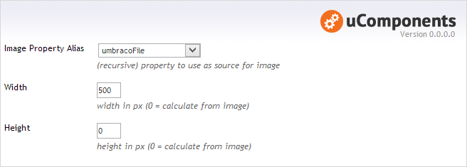

## Prevalue Editor Settings

**Image Property Alias** :  The property alias to to use for the image url source. This can be a property on the same node, or (if on content / media) then it can be a property further up the tree hierarachy - the closest property is used.

**Width** : When specified, this will override the image width.

**Height** : When specified, this will override the image height.

If either a _Width_ or _Height_ is specified, and the other is set to 0, then the one set to 0 will be calculated from the image dimensions so as to maintain the correct aspect ratio.

## Content Editor

This datatype stores a single coordinate value (stored as a simple csv string, where the first item is the X coordinate, and the second, the Y coordinate) but can it can also be implemented in a such a way that multiple coordinates for a given image can be specified. For example, the original use-case was to be able to indicate office locations on a stylised image of the world - to achieve this, we created a content node called 'Offices' with an image upload field (for the world image) and then, each child node of type 'Office' had an instance of this datatype. The datatype was configured to use look for the image of the world on the parent. This approach was taken as it keeps this dataype simple, yet allow full flexibility for any data that may need to be associated with a coordinate (such data can be added to the child nodes using any dataype).

## uQuery
	
	ImagePoint imagePoint = uQuery.GetMedia(123).GetProperty<ImagePoint>("propertyAlias");
	int x = imagePoint.X;
	int y = imagePoint.Y;

