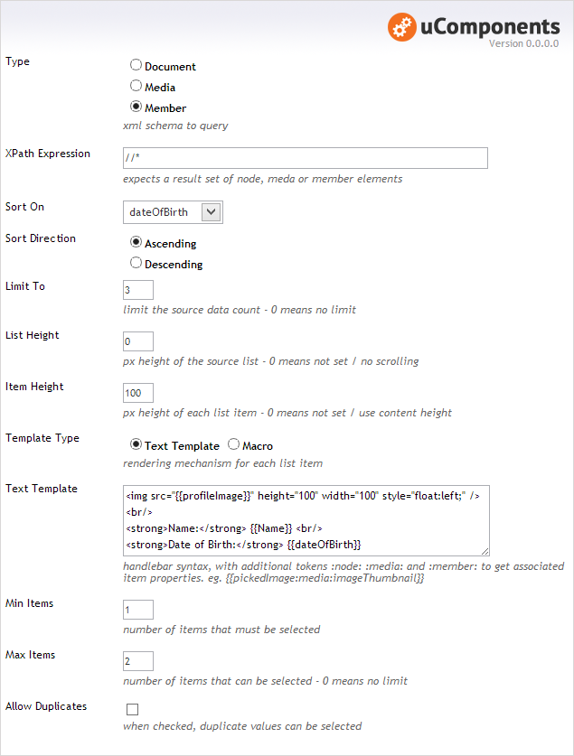
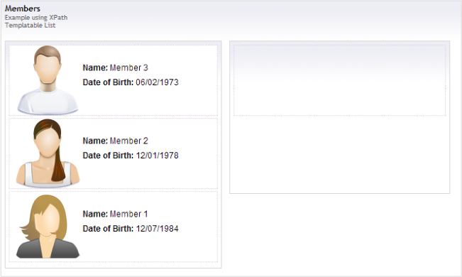

## Prevalue Editor Settings

In the example above, the datatype has been configured to use the three oldest members, requiring one or two of them to be selected.

**Type** : The XML schema to query.

**XPath Expression** : All matched nodes will be used for the source data in the list.

**Sort On** : Allows the source data to be sorted.

**Sort Direction** : (only present when _Sort On_ set)

**Limit To** : Limit the source data to a defined count.

**List Height** : Height in px, of the whole control - useful for when there is a sizeable amount of data in the source list; a scroll bar will be added if the height of all items exceeds this value.

**Item Height** : Height in px of each item.

**Template Type** : (TODO: select between _Text Template_ or _Macro Template_)

**Text Template** : Markup used for each item in the list - values can be injected using handlebars style syntax, and a simple token matching system allows for associated data to be rendered - for example if a a node has a picker that selects a media item, then it's also possible to get at the data for this picked media item:

	eg. \{\{pickedMediaPropertyAlias:media:mediaPropertyAlias\}\}

	it's also possible to get associated members or nodes with using the same approach:

	eg. \{\{pickedMemberPropertyAlias:member:memberPropertyAlias\}\}
	or  \{\{pickedNodeProprtyAlias:node:nodePropertyAlias\}\}
	

**Macro Template** : (TODO: using a macro will allow Razor / XSLT logic to be used for each item being rendered.)

**Min Items** : Number of items that must be selected. The Content Editor UI illustrates this value by drawing empty boxes as placeholders to indicate that items need to be selected.

**Max Items** : Number of items that can be selected. The Content Editor UI illustrates this value by drawing a bounding box around the selected list on the right to indicate how many items can be selected.

**Allow Duplicates** : When checked, the same item in the source list can be selected multipe times (assuming this is also within the parameters of the _Max Items_ value above).

## Content Editor

In the above example, no items have yet been selected, but once selected the items will appear on the list to the right, and can be sorted (via drag-n-drop) like MNTP, XPath / SQL AutoComplete etc...
