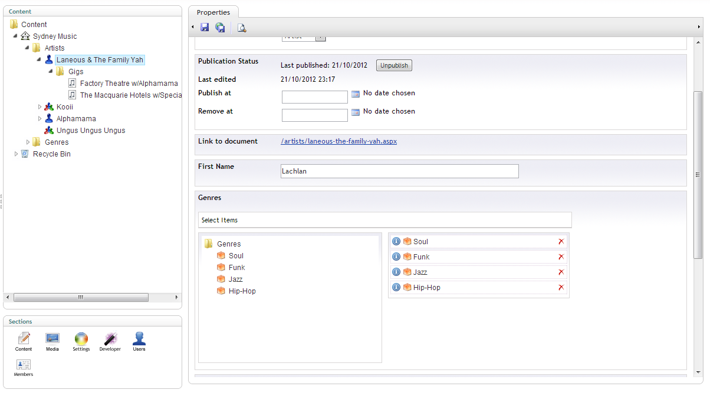

  <h1>uMapper</h1>

_Available in uComponents 5.1.0_

uMapper lets .NET developers map nodes to strongly typed objects with minimal configuration.  It does its best to map the properties of a node to an object by name, but features a fluent interface for manual configuration in the much the same way AutoMapper does.

I've put together an [example project](https://bitbucket.org/JamesDiacono/umapperexample/src) with Umbraco 4.9.0 which shows example usage of uMapper. The username and password to the Umbraco back office are both "admin".

## Usage (minimal configuration) ##
1. Add a reference to uComponents.Mapping.dll in your web project (this should already be added if you used NuGet to install uComponents).
2. Create your document types in Umbraco:

Make sure you use CSV as the data format for any multi-node pickers you use.
3. Create your corresponding models as .NET classes in your project, naming the classes the same as the document type aliases:

public class Artist
{
    public string Name { get; set; }
    public List<Genre> Genres { get; set; }
}
 
4. Create a `Global.asax` file and on `Application_Start()` create your maps:

protected void Application_Start(object sender, EventArgs e)
{
    uMapper.CreateMap<Site>();
    uMapper.CreateMap<Genre>();
    uMapper.CreateMap<Artist>();
}
 
5. Start mapping!

public partial class Site : System.Web.UI.MasterPage
{
    protected Homepage Model { get; set; }
    protected IEnumerable<Artist> Artists { get; set; }
    protected IEnumerable<Genre> Genres { get; set; }

    protected void Page_Load(object sender, EventArgs e)
    {
        this.Model = uMapper.GetCurrent<Homepage>();

        this.Artists = uMapper.GetAll<Artist>()
            .OrderBy(artist => artist.Name);
        this.Genres = uMapper.GetAll<Genre>();
    }
}
 
## Default mapping behaviour for model properties ##
* A collection of `TDestination` (without a corresponding node property) will map from all descendant nodes which map to `TDestination`.
* A `TDestination` (without a corresponding node property) will map the closest ancestor node which maps to `TDestination`.
* Using a collection of `int` will map node IDs rather than models.
* Properties with the same name as properties on `umbraco.NodeFactory.Node` will map automagically.
* Custom collections which implement `IEnumerable<>` and take a single argument constructor of `IEnumerable<>` can be used.
## Advanced ##
### Overriding the node type alias ###
`uMapper.CreateMap<Artist>("SomeNodeTypeAlias");`
### Overriding the default property mapping ###

uMapper.CreateMap<Artist>()
    .ForProperty(
        x => x.Name, // Choose the model property
        node => node.GetProperty<string>("AlternateName"), // Specify a custom mapping
        false // Decide if this mapping counts as a relationship
        );
 
### Removing the default mapping for a property ###
`uMapper.CreateMap<Artist>().RemoveMappingForProperty(x => x.Name);`
### Mapping without populating relationships ###
`uMapper.Get<Artist>(1063, false);`